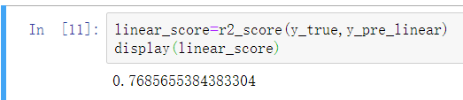
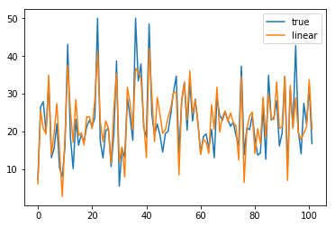

# 用LinearRegression对波士顿房价进行预测

## 主要通过调用sklearn中通过用最小二乘法求解的LinearRegression线性回归模型来实现
## 实现较为简单

## 主要分为7个部分：
## 1.导入模块
选择sklearn自带的波士顿房价数据集

import numpy 用于做科学计算

import pandas 用于做数据分析

## 2.生成训练数据和测试数据
通过设定test_size=0.2来设置测试集是占数据集的五分之一，
即将数据集按照8:2的比例划分为数据集和测试集

## 3.创建学习模型
## 4.训练模型
## 5.预测数据
## 6.评分
用r2_score函数评分

## 7.绘图
用matplotlib.pyplot绘图

展示预测结果及其精确度
 
