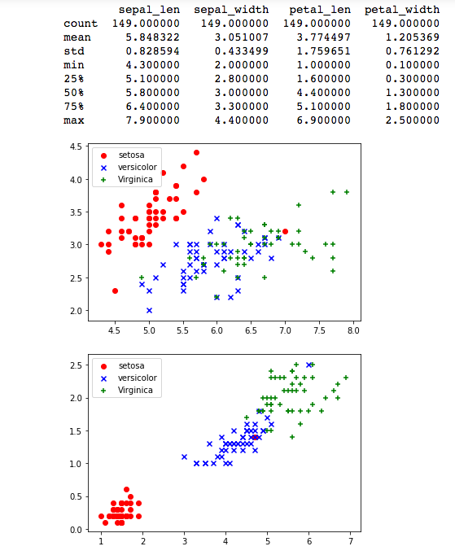

### 鸢尾花数据集
由于该数据集分类标签划分为3类，分别是山鸢尾（Iris-setosa）、变色鸢尾（Iris-versicolor）和维吉尼亚鸢尾（Iris-virginica），可以很好的适用于逻辑回归模型。
 
在Sklearn机器学习包中,集成了包括鸢尾花卉的数据集，直接使用。

### 散点图绘制
获取鸢尾花数据集中花瓣和花萼各自的两个特征，分别调用scatter()函数绘制花瓣的两个特征和花萼的两个特征的散点图。从中观察得知，花瓣长度、花瓣宽度、花萼长度、花萼宽度四个特征之间的数据集是线性可分的。

### 采用逻辑回归对其进行分类预测
 利用Sklearn机器学习扩展包逻辑性回归模型，进行训练和预测。

## 过程分析可视化
 
